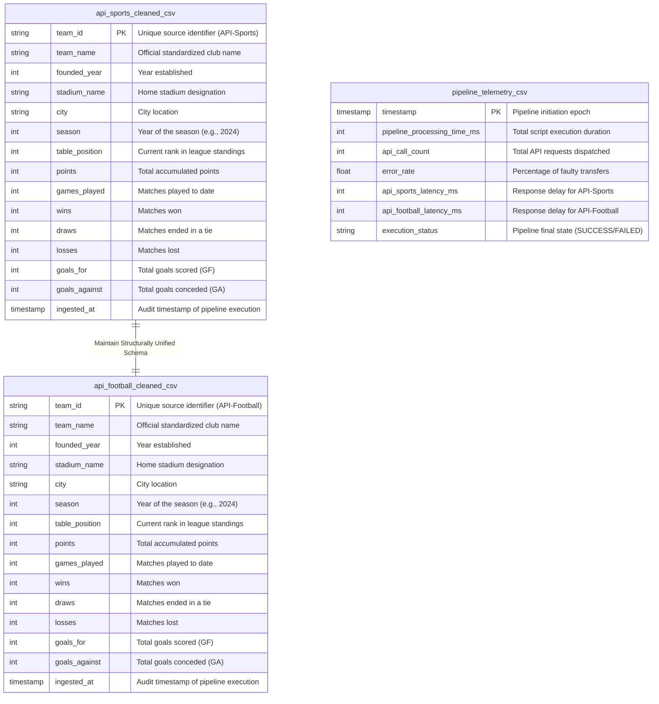

אין בעיה בכלל, בוא נסגור את זה בצורה הכי נקייה שיש.

הנה כל התוכן של קובץ ה-`README.md` מתחילתו ועד סופו, בדיוק כפי שהוא צריך להיכתב בתוך הקובץ עצמו (ללא תיבות קוד עוטפות מסביב, כדי שלא יהיה לך שום בלבול בהעתקה).

פשוט תעתיק את כל הטקסט מכאן למטה, תמחק את מה שיש לך כרגע בקובץ `README.md` ב-PyCharm, ותדביק את זה פנימה:

# Premier League ETL Pipeline (Multi-Source Integration)

A robust, enterprise-grade Data Integration Pipeline that ingests Premier League data for the 2024 season from two distinct API endpoints: **API-Sports** and **API-Football**. The pipeline unifies structural anomalies, enforces a standardized schema, performs strict data-quality auditing, and isolates target datasets into analytical deliverables.

---

## 1. Pipeline Design & Architecture

The architecture follows modern **ELT/Modular Pipeline** principles, ensuring decoupling between raw landing storage, structural transformation, and final target delivery.

```text
[API-Sports Source]     [API-Football Source]
        │                       │
        ▼                       ▼
  [Live HTTP Ingestion via requests.Session]
                        │
                        ▼
         [Dynamic Temp Landing Zone]
           (Self-Cleaning JSONs)
                        │
                        ▼
       [Left Join on Standings Anchor]
          (Strict Data Type Casting)
                        │
                        ▼
           [Validated CSV Exports]
         (Isolated Analytical Tables)

```

### Core Execution Flow:

1. **Live Ingestion Layer:** Concurrent connections are opened against both remote REST APIs using a resilient `requests.Session` wrapped with automated exponential backoff retries (`HTTPAdapter`).
2. **Dynamic Landing Zone (`tempfile`):** Raw JSON responses (`teams` and `standings`) are written to disk inside the operating system's isolated virtual memory/temp layer. This eliminates hardcoded directory dependencies and ensures **100% Portability** across any Unix/Windows environment.
3. **Transformation & Normalization:** Raw structures are unwrapped via Pandas, standardized against a localized string baseline, and joined utilizing logical guardrails.
4. **Self-Cleaning Execution:** As the script execution completes, the temporary landing directory is automatically destroyed by the runtime environment, leaving zero cache footprints.
5. **Target Delivery:** Two distinct, schema-aligned CSV datasets are written to the active workspace directory for downstream storage or warehouse loading.

---

## 2. Schema Decisions & Data Harmonization

### Unified Target Schema (14 Fields)

The unified schema was carefully modeled to combine static structural properties (Metadata) with fluid performance metrics (Season-Stats), enabling a holistic 360-degree analytical query layer:

| Field Name | Data Type | Analytical Context / Justification |
| --- | --- | --- |
| `team_id` | `String` | Unique structural identifier from the specific source API context. |
| `team_name` | `String` | Human-readable standardized name, capitalized cleanly for UI reporting. |
| `founded_year` | `Integer` | Static metadata tracking the club’s chronological age/historical context. |
| `stadium_name` | `String` | Core facility attribute. Defaults to `Unknown` if unavailable. |
| `city` | `String` | Geographical dimension used for regional grouping and slicing. |
| `season` | `Integer` | Partition key / Temporal anchor tracking the specific scope (2024). |
| `table_position` | `Integer` | Primary performance indicator ranking the team within the competition grid. |
| `points` | `Integer` | Quantifiable season metric determining rank hierarchy. |
| `games_played` | `Integer` | Normalization factor used to compute average point-yield velocity. |
| `wins` | `Integer` | Success performance dimension. |
| `draws` | `Integer` | Tie performance dimension. |
| `losses` | `Integer` | Negative variance performance dimension. |
| `goals_for` | `Integer` | Offensive volume indicator (Goals Scored). |
| `goals_against` | `Integer` | Defensive leak indicator (Goals Conceded). |

### Resolving Naming Mismatches: Current Dictionary vs. Enterprise Scale

To accurately merge records on team names, we implemented a string normalization function (`normalize_team_name`).

* **Current Implementation (In-Memory Dictionary):** For the scope of this project—tracking a single closed league with exactly 20 stable teams—hardcoding an in-memory mapping dictionary is a highly efficient and lightweight decision. It introduces minimal computational overhead and completely eliminates database lookup latency.


* **Production Scaling Architecture (Enterprise Mapping Tables):** If this pipeline were scaled up to support a global multi-league sports analytics framework (covering thousands of teams across UEFA, FIFA, etc.), an hardcoded dictionary would become an anti-pattern (unmaintainable code debt).
In a large-scale scenario, we would migrate to a **Master Data Management (MDM) Database Table** structure:
[Source API String] ──► [Database Mapping Table (Postgres/BigQuery)] ──► [Standardized Master Team ID]
The pipeline would fetch this translation dictionary dynamically at runtime or use a SQL staging step to perform the normalization via an `INNER JOIN` against a dedicated schema reference table, allowing Data Stewards to update naming variations without modifying application code.

### The Left-Join Standing Anchor Boundary Anomaly

During validation, a significant edge-case anomaly was discovered: **API-Football** returns a bloated, historical roster list of teams under its metadata endpoint (including relegated teams), whereas **API-Sports** restricts returns strictly to the current active season grid.

To overcome this, the pipeline enforces a **Deterministic Alignment Strategy**: instead of an `Inner Join` (which threw away valid teams due to naming edge cases), the pipeline utilizes the **Standings dataset as the immutable left anchor** via a `Left Join`. The standings endpoint is mathematically guaranteed to hold exactly 20 active rows for a live season grid. Missing descriptive metadata fields are dynamically defaulted to `'Unknown'` or `0`.

---

## 3. Errors, Alerting Logic & System Assumptions

### Resiliency & Alerting Logic

* **Network Tolerance:** Built-in tolerance handles network hiccups or API throttle drops (`HTTP 429`, `5xx`) by automatically firing 3 timed backoff retries before declaring a pipeline halt.
* **ANSI Colored Logging Layer:** To replace archaic black-and-white output text, a custom `SimpleColoredFormatter` is injected directly into Python's native logging engine. This allows operations to evaluate pipeline health at a glance using zero external library dependencies:
* **INFO (Green):** Tracks successful lifecycle completions and ingestion parameters.
* **WARNING (Yellow):** Fires an automated **Data Quality Audit Alert** if final dataset rows deviate from boundaries.
* **ERROR / CRITICAL (Red):** Intercepts infrastructure dropouts or bad API authorizations, safely halting state tracking.
* **Log Duplication Safe Guard:** The pipeline logger explicitly bypasses propagation handlers (`logger.propagate = False`), preventing duplicate log bursts across aggressive IDE runtimes like PyCharm.

### Core Architecture Assumptions

1. **Fixed League Boundaries:** It is assumed that the Premier League always bounds itself to exactly 20 competing clubs per active season.
2. **Schema Defaulting:** If an API completely lacks specific metadata, the system assumes a safe fallback to `'Unknown'` rather than causing an structural ingestion drop.
3. **Data Availability Match:** It is assumed that both upstream vendor microservices are up-to-date and populated for the targeted temporal runtime window (`Season 2024`).

---

## 4. Production Scheduling & Orchestration

The codebase is highly abstract and decoupled from localized directories, rendering it fully ready for transition into orchestration environments.

### Current Script Status (`--scheduled` flag)

The scheduling block inside the execution controller (`run_scheduled_pipeline`) is **explicitly commented out / marked out** for this submission. Because this codebase currently runs in a localized testing runtime context without a persistent host server, initiating an active, infinite loop scheduler (`while True`) would unproductively tie up local compute resources.

### Target Production Implementations

When deploying to an official staging or production cloud architecture, scheduling would be orchestrated using one of the following two standard patterns:

1. **Serverless Cron (AWS Lambda / Google Cloud Functions):** The application code can be packaged directly into a lightweight Docker Container. Since data processing is managed via stateless memory blocks (`tempfile`), a cloud-native scheduler like **AWS EventBridge** or **Google Cloud Scheduler** would trigger the container execution as a Cron-job once every 24 hours (e.g., at 02:00 AM).
2. **Data Orchestration DAGs (Apache Airflow / Prefect):** In an enterprise data platform, the `run_entire_etl_pipeline()` module serves as an atomic Task Node within an **Airflow DAG**. This architecture allows the platform to map dependency lineages, track upstream system health, and wire automated Slack notifications on pipeline failure blocks.

---

## 5. Getting Started & Configuration

To run this pipeline locally or in a deployment environment, the execution engine decouples sensitive credentials and environment variables from the codebase using a centralized configuration file.

### 5.1 Configuration Setup (`config.json`)

Before executing the script, you must create a file named `config.json` in the root directory of the project (the same folder as `pipeline.py`). Populate this file with your vendor API keys and targeted scope:

```json
{
  "api_sports": {
    "key": "YOUR_API_SPORTS_KEY",
    "season": 2024,
    "league_id": 39
  },
  "api_football": {
    "key": "YOUR_API_FOOTBALL_KEY",
    "league_id": 152
  }
}

```

### 5.2 Local Execution

Once the configuration artifact is initialized, install the required dependencies and execute the baseline pipeline controller directly:

```bash
# Execute standard pipeline delivery flow
python pipeline.py

```

---

## 6. Data Architecture & Schema Documentation

To satisfy the core requirement of keeping the ingestion sources completely isolated ("*keep the data from API-Sports separate*") while strictly maintaining a unified structure, a **Physical Denormalized Flat Model** was selected for the file-based storage layer.

This architectural approach optimizes read performance for downstream Business Intelligence (BI) tools, removing the need for computationally heavy runtime analytical `JOIN` operations inside **Looker Studio**.

### 6.1 Physical Entity-Relationship Diagram (ERD)

The following schema represents the actual deployment architecture of the generated artifacts, demonstrating structural parity between the ingestion pipelines alongside the operational observability ledger:



---

## 7. [BONUS] Operational Observability & Data-Monitoring Dashboard

To satisfy the advanced tracking requirements, an enterprise-grade **Data Observability Dashboard** was deployed via **Looker Studio**. This interface provides the operations team with near-real-time visibility into the infrastructure health, execution status, and data volumetric metrics across all runtime lifecycles.

### 7.1 Core Metrics Monitored

* **Pipeline Volumetrics:** Real-time logging of raw API ingestion payloads versus successfully structured file exports to validate zero-drop processing.
* **System Latency Tracking:** Independent performance mapping of `api_sports_latency_ms` and `api_football_latency_ms` to evaluate vendor upstream reliability.
* **Infrastructure Runtime Performance:** Historical tracking of total execution duration (`pipeline_processing_time_ms`) across sequential processing stages.
* **Operational Error Budget:** A standalone alerting logic layer translating pipeline state parameters into data metrics (`SUCCESS`, `PARTIAL_WARNING`, or `FAILED` execution rates).

### 7.2 Architectural Scaling & Production Roadmap

* **Current Implementation (Academic/Testing Scope):** For the scope of this submission, the runtime telemetry metrics are captured within the `pipeline_api_stats` (or `pipeline_telemetry_df`) DataFrame and persisted as a localized flattened artifact (`pipeline_telemetry.csv`) before being linked to the monitoring view.
* **Target Enterprise Infrastructure (Production Scale):** In a production environment, dropping local CSVs is an anti-pattern. Instead, the final storage layer would switch from file-based storage to a managed cloud data warehouse. The pipeline execution flow would stream the telemetry metrics directly into a partitioned **Google BigQuery** logging table utilizing `google-cloud-bigquery` insert methods.
* **Live Dashboards:** Looker Studio would then establish a native, direct BigQuery connector instance. This architecture ensures real-time operational updates, automated data lifecycle management, and enterprise-grade auditing without local file dependencies.

### 7.3 Live Production Access

The operational control plane can be accessed dynamically via the following production delivery node:

👉 **[Click Here to Access the Live Looker Studio Data-Monitoring Dashboard](https://datastudio.google.com/reporting/b1e61ae0-76d6-436d-bf66-a7ab4067e800)**